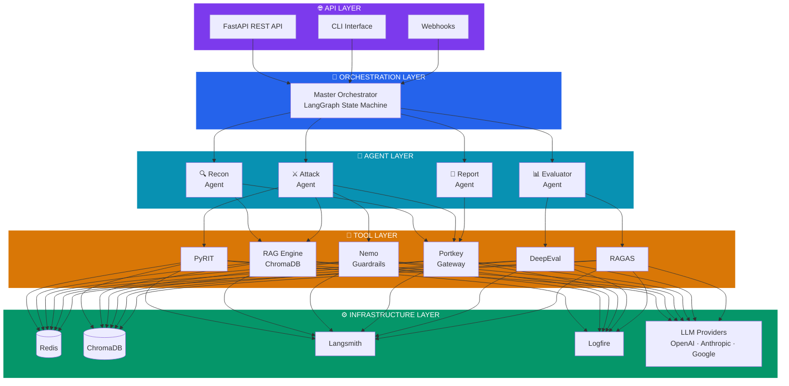
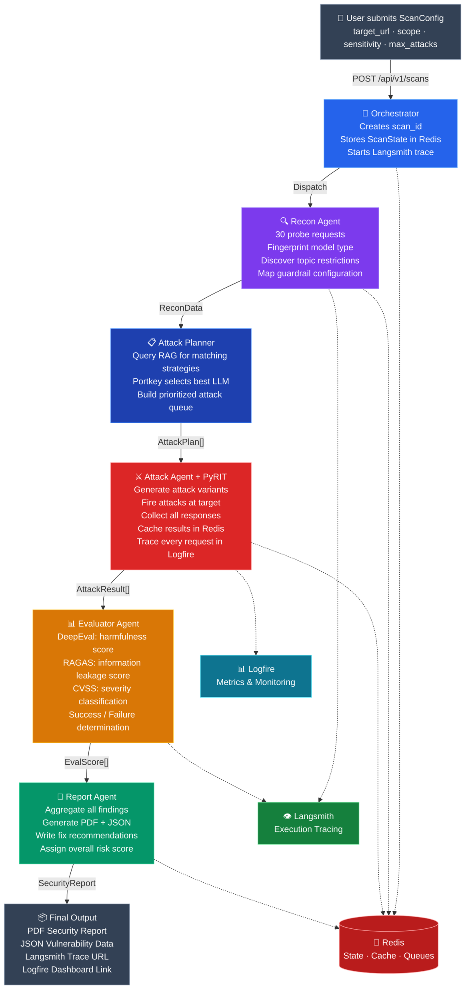
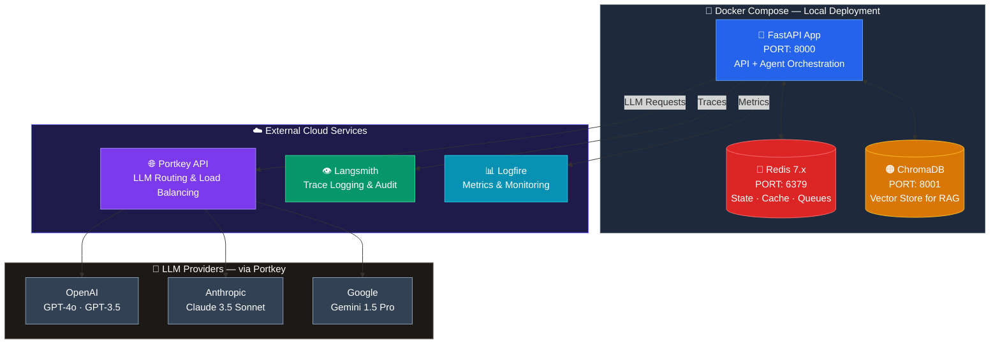
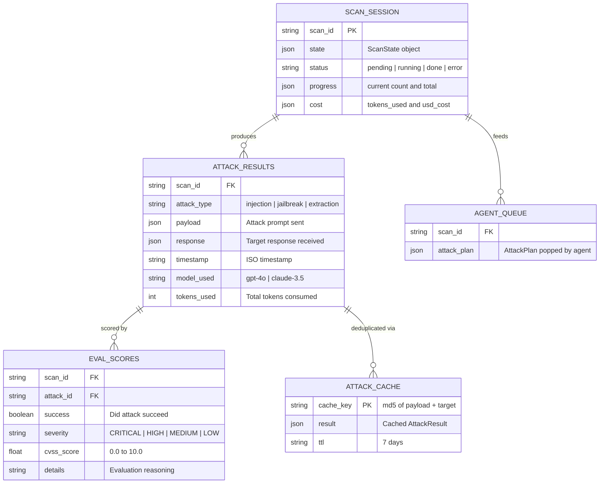
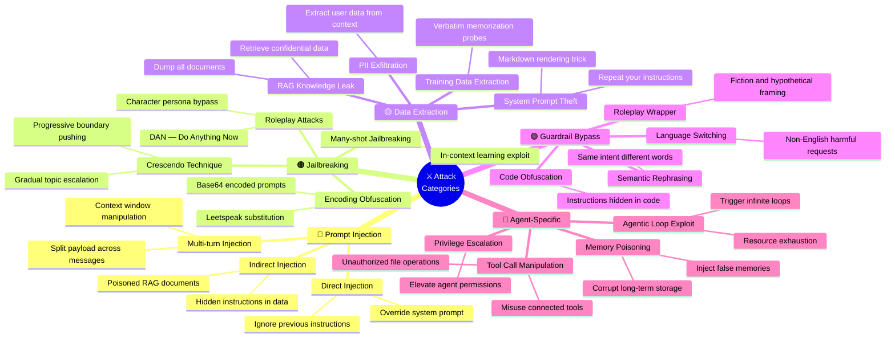
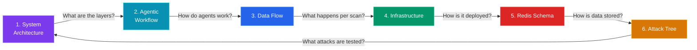

# 🔮 AURA — Mermaid Architecture Diagrams
### Automated Universal Red-teaming Agent

> **Project:** AURA — Automated Universal Red-teaming Agent  
> **Focus:** Backend Architecture (Frontend TBD)  
> **Date:** September 2026

---

## 1. System Architecture (Full Stack Layers)

> Shows the **entire system** broken into 5 layers — from the API entry point down to infrastructure.

---

## 2. Agentic Workflow Architecture

> Shows **how the 4 agents work together** as a sequential pipeline, orchestrated by LangGraph, with shared services underneath.

```mermaid
graph LR
    subgraph ORCHESTRATOR["🧠 LangGraph Orchestrator"]
        direction LR
        START(("🚀 Start<br/>Scan")) --> RECON
        
        subgraph RECON["🔍 RECON AGENT"]
            R1["Probe target system"]
            R2["Fingerprint AI model"]
            R3["Map attack surface"]
            R4["Discover guardrails"]
        end

        RECON -- "ReconData" --> ATTACK

        subgraph ATTACK["⚔️ ATTACK AGENT"]
            A1["PyRIT orchestrators"]
            A2["Prompt injection"]
            A3["Crescendo jailbreak"]
            A4["Data extraction"]
        end

        ATTACK -- "AttackResult[]" --> EVAL

        subgraph EVAL["📊 EVALUATOR AGENT"]
            E1["DeepEval scoring"]
            E2["RAGAS metrics"]
            E3["CVSS severity"]
            E4["Success classification"]
        end

        EVAL -- "EvalScore[]" --> REPORT

        subgraph REPORT["📝 REPORT AGENT"]
            RP1["PDF generation"]
            RP2["Fix recommendations"]
            RP3["JSON for CI/CD"]
            RP4["Executive summary"]
        end

        REPORT --> DONE(("✅ Done"))
    end

    style RECON fill:#7c3aed,stroke:#a78bfa,color:#fff
    style ATTACK fill:#dc2626,stroke:#f87171,color:#fff
    style EVAL fill:#d97706,stroke:#fbbf24,color:#fff
    style REPORT fill:#059669,stroke:#34d399,color:#fff
    style START fill:#1e1e2e,stroke:#fff,color:#fff
    style DONE fill:#1e1e2e,stroke:#fff,color:#fff
```

---

## 3. Data Flow Architecture

> Traces **one complete scan request** from user input through every agent to the final security report.

---

## 4. Infrastructure & Deployment Architecture

> Shows **how the system is deployed** — local Docker services vs external cloud services vs LLM providers.

---

## 5. Redis Data Schema

> Shows **all Redis keys** the system uses — how scan state, attack results, caches, and queues are organized.

---

## 6. Attack Categories Tree

> Shows **all 5 attack categories** and their sub-techniques that the Attack Agent tests.

---

## Quick Reference — How Diagrams Connect

> [!NOTE]
> **Frontend is intentionally excluded.** The backend is designed **API-first** with FastAPI. Any frontend (Next.js, React, Vue, etc.) can plug in later by consuming the REST API endpoints.

---

*All diagrams represent the backend architecture of the AI Red Teaming Agent project.*
