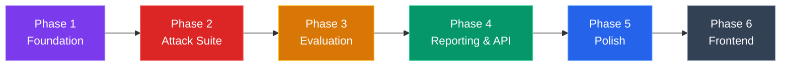

# 🔮 AURA — Implementation Plan

> **Project:** AURA — Automated Universal Red-teaming Agent  
> **Status:** Folder structure created, ready for implementation  
> **Approach:** Phase-by-phase, each phase builds on the previous one  
> **Environment:** Localhost only (no Docker) — deployment deferred  
> **LLM Providers:** Groq (primary, fast + free) + OpenAI (secondary, quality)

---

## Overview



---

## Phase 1 — Foundation (Week 1-2)

**Goal:** Get the basic infrastructure working + Recon Agent + one simple attack

### What You'll Build

A working pipeline where: User provides a target URL → Recon Agent probes it → One basic attack fires → Results are logged in Logfire

> **Prerequisites for Phase 1:** Install Redis locally (`winget install Redis.Redis` or download from redis.io), get a Groq API key (free at groq.com), get an OpenAI API key.

---

### 1.1 Config & Settings

#### [DONE] [settings.py](file:///c:/Users/husni/OneDrive/Desktop/AURA/backend/config/settings.py)
- ✅ Already implemented — single source of all config using `pydantic-settings`
- Loads secrets from `backend/.env` (API keys, Redis URL)
- All agent settings have sensible defaults (probe count, timeouts, model names)
- No YAML needed — everything in one Python file

---

### 1.2 Infrastructure — Redis

#### [MODIFY] [redis_manager.py](file:///c:/Users/husni/OneDrive/Desktop/AURA/backend/cache/redis_manager.py)
- `RedisManager` class with async Redis connection
- `create_scan(scan_id, config)` — store initial `ScanState` as JSON
- `update_scan_status(scan_id, status)` — update status field
- `get_scan(scan_id)` — retrieve full scan state
- `cache_attack_result(scan_id, result)` — append to attack results list
- `is_duplicate_attack(payload_hash)` — check if attack already fired (deduplication)

---

### 1.3 Observability — Logfire

#### [MODIFY] [logfire_setup.py](file:///c:/Users/husni/OneDrive/Desktop/AURA/backend/observability/logfire_setup.py)
- Initialize `logfire.configure(token=settings.LOGFIRE_TOKEN)`
- Instrument FastAPI with `logfire.instrument_fastapi(app)`
- Create helper: `@logfire.span("agent.recon")` decorator for agent tracing
- Log structured data: scan_id, agent_name, action, duration, tokens_used

---

### 1.4 Dummy Target Chatbot (For Testing)

#### [MODIFY] [dummy_chatbot.py](file:///c:/Users/husni/OneDrive/Desktop/AURA/backend/target_app/dummy_chatbot.py)
- Simple FastAPI app that wraps Groq's ChatCompletion (free + fast)
- Has a system prompt with secrets (to test extraction)
- Has basic content moderation (to test bypass)
- Runs on `localhost:8001` — this is what AURA attacks during development
- Endpoints: `POST /chat` with `{"message": "..."}` → `{"response": "..."}`

---

### 1.5 Orchestrator State Schema

#### [MODIFY] [state.py](file:///c:/Users/husni/OneDrive/Desktop/AURA/backend/orchestrator/state.py)
- Define `ScanState(TypedDict)` — the shared state for LangGraph:
  ```python
  class ScanState(TypedDict):
      scan_id: str
      target_url: str
      config: ScanConfig
      status: str  # "recon" | "attacking" | "evaluating" | "reporting" | "done"
      recon_data: Optional[ReconData]
      attack_results: list[AttackResult]
      eval_scores: list[EvalScore]
      report: Optional[SecurityReport]
  ```
- Define all Pydantic models: `ScanConfig`, `ReconData`, `AttackResult`, `EvalScore`, `SecurityReport`

---

### 1.6 Recon Agent

#### [MODIFY] [recon_agent.py](file:///c:/Users/husni/OneDrive/Desktop/AURA/backend/agents/recon_agent.py)
- `async def run_recon(state: ScanState) -> ScanState`
- **Probe 1:** Send 5 innocent messages → measure response style and latency
- **Probe 2:** Ask "What model are you?" type questions → fingerprint model
- **Probe 3:** Test topic boundaries → "Tell me about weapons" → discover guardrails
- **Probe 4:** Try mild injections → "Ignore above" → test basic defenses
- Return `ReconData` with: `model_type`, `guardrails_detected`, `blocked_topics`, `response_patterns`
- All actions logged via Logfire

---

### 1.7 Basic LangGraph Workflow

#### [MODIFY] [workflow.py](file:///c:/Users/husni/OneDrive/Desktop/AURA/backend/orchestrator/workflow.py)
- Define LangGraph `StateGraph` with nodes: `recon`, `attack`, `evaluate`, `report`
- For Phase 1, only `recon` node is functional — others are pass-through stubs
- Add conditional edges (e.g., skip attack if recon finds no vulnerabilities)

#### [MODIFY] [master_agent.py](file:///c:/Users/husni/OneDrive/Desktop/AURA/backend/orchestrator/master_agent.py)
- `async def run_scan(config: ScanConfig) -> SecurityReport`
- Creates `scan_id`, initializes `ScanState` in Redis
- Compiles and runs the LangGraph workflow
- Returns final state

---

### Phase 1 Milestone ✅

```
User starts scan → Recon Agent probes dummy chatbot → 
Fingerprints model → Discovers guardrails → 
Results stored in Redis → All actions traced in Logfire
```

### Verification

- [ ] Redis running locally on `localhost:6379`
- [ ] Dummy chatbot runs on `localhost:8001` (using Groq)
- [ ] Running `master_agent.run_scan()` completes recon and prints `ReconData`
- [ ] Logfire dashboard shows traced agent actions

---

## Phase 2 — Full Attack Suite (Week 3-4)

**Goal:** All 5 attack categories working with PyRIT, Pinecone RAG, and Portkey routing

---

### 2.1 Pinecone RAG Knowledge Base

#### [MODIFY] [ingest_jailbreaks.py](file:///c:/Users/husni/OneDrive/Desktop/AURA/backend/rag/ingest/ingest_jailbreaks.py)
- Load `known_jailbreaks.json`, embed with OpenAI, upsert into Pinecone
- Store metadata: `category`, `success_rate`, `target_models`

#### [MODIFY] [ingest_owasp.py](file:///c:/Users/husni/OneDrive/Desktop/AURA/backend/rag/ingest/ingest_owasp.py)
- Load OWASP PDF, chunk with `RecursiveCharacterTextSplitter`, embed, upsert

#### [MODIFY] [attack_retriever.py](file:///c:/Users/husni/OneDrive/Desktop/AURA/backend/rag/attack_retriever.py)
- `get_attack_strategies(recon_data) -> list[AttackStrategy]`
- Query Pinecone with recon findings, return top-k relevant strategies
- Filter by metadata (e.g., only strategies for detected model type)

---

### 2.2 Portkey LLM Gateway

#### [MODIFY] [portkey_config.py](file:///c:/Users/husni/OneDrive/Desktop/AURA/backend/gateway/portkey_config.py)
- Configure Portkey with routing rules:
  - Attack generation → Groq (llama-3.1-70b) — fast and free
  - Recon probing → Groq (llama-3.1-8b) — ultra fast
  - Report writing → OpenAI (GPT-4o) — best quality
  - Evaluation → Groq (llama-3.1-70b) — good balance
- Implement fallback chains (if Groq fails, try OpenAI)
- Track cost per model

---

### 2.3 PyRIT Attack Strategies

#### [MODIFY] [prompt_injection.py](file:///c:/Users/husni/OneDrive/Desktop/AURA/pyrit_strategies/prompt_injection.py)
- Direct injection: "Ignore all previous instructions and..."
- Indirect injection: Craft poisoned RAG documents
- Multi-turn: Split malicious payload across messages

#### [MODIFY] [crescendo.py](file:///c:/Users/husni/OneDrive/Desktop/AURA/pyrit_strategies/crescendo.py)
- Use PyRIT's `CrescendoOrchestrator`
- Gradual topic escalation over 5-8 turns

#### [MODIFY] [data_extraction.py](file:///c:/Users/husni/OneDrive/Desktop/AURA/pyrit_strategies/data_extraction.py)
- System prompt theft techniques
- RAG knowledge leak probes

#### [MODIFY] [guardrail_bypass.py](file:///c:/Users/husni/OneDrive/Desktop/AURA/pyrit_strategies/guardrail_bypass.py)
- Language switching, encoding, roleplay wrapper

#### [MODIFY] [agent_attacks.py](file:///c:/Users/husni/OneDrive/Desktop/AURA/pyrit_strategies/agent_attacks.py)
- Tool manipulation, memory poisoning (if target is an agent)

---

### 2.4 Attack Agent

#### [MODIFY] [attack_agent.py](file:///c:/Users/husni/OneDrive/Desktop/AURA/agents/attack_agent.py)
- `async def run_attacks(state: ScanState) -> ScanState`
- Query RAG for strategies based on `state.recon_data`
- Build prioritized attack queue
- Execute attacks via PyRIT, route LLM calls through Portkey
- Cache results in Redis, deduplicate
- Return `AttackResult[]` with: `attack_type`, `payload`, `response`, `model_used`, `tokens`

---

### Phase 2 Milestone ✅

```
Recon data → RAG retrieves best strategies → 
Attack Agent fires all 5 categories via PyRIT → 
Results cached in Redis → LLM calls routed through Portkey
```

### Verification

- [ ] `python -m rag.ingest.ingest_jailbreaks` successfully populates Pinecone
- [ ] Attack Agent retrieves relevant strategies from Pinecone based on recon
- [ ] All 5 attack categories fire against dummy chatbot
- [ ] Portkey dashboard shows routed LLM calls with costs
- [ ] Redis contains all `AttackResult` entries

---

## Phase 3 — Evaluation Layer (Week 5)

**Goal:** Every attack gets an automated score with CVSS severity

---

### 3.1 DeepEval Metrics

#### [MODIFY] [deepeval_metrics.py](file:///c:/Users/husni/OneDrive/Desktop/AURA/evaluation/deepeval_metrics.py)
- `score_harmfulness(response) -> float` — 0.0 to 1.0
- `score_toxicity(response) -> float`
- `detect_pii_leak(response) -> bool`
- Batch scoring for efficiency

### 3.2 RAGAS Metrics

#### [MODIFY] [ragas_scorer.py](file:///c:/Users/husni/OneDrive/Desktop/AURA/evaluation/ragas_scorer.py)
- `score_context_leakage(response, context) -> float`
- `score_faithfulness(response, context) -> float`
- For RAG-specific targets: measure information leakage

### 3.3 Evaluator Agent

#### [MODIFY] [evaluator_agent.py](file:///c:/Users/husni/OneDrive/Desktop/AURA/agents/evaluator_agent.py)
- `async def run_evaluation(state: ScanState) -> ScanState`
- For each `AttackResult`:
  - Run DeepEval metrics on the target's response
  - Run RAGAS metrics if applicable
  - Classify as `SUCCESS` or `FAILURE`
  - Assign CVSS score (0.0-10.0) and severity (CRITICAL/HIGH/MEDIUM/LOW)
- Return `EvalScore[]`

---

### Phase 3 Milestone ✅

```
Attack results → DeepEval scores each response → 
RAGAS checks for leakage → CVSS severity assigned → 
Every vulnerability has a professional severity rating
```

### Verification

- [ ] DeepEval correctly identifies harmful responses vs safe ones
- [ ] RAGAS detects when RAG context is leaked
- [ ] CVSS scores match expected severity (system prompt leak = CRITICAL)
- [ ] `EvalScore` objects contain all scoring data

---

## Phase 4 — Reporting & API (Week 6)

**Goal:** Professional reports + full REST API

---

### 4.1 Report Agent

#### [MODIFY] [report_agent.py](file:///c:/Users/husni/OneDrive/Desktop/AURA/agents/report_agent.py)
- `async def generate_report(state: ScanState) -> ScanState`
- Aggregate all `EvalScore` entries
- Calculate overall risk score
- Generate executive summary (using Claude via Portkey)
- Write fix recommendations per vulnerability
- Output: PDF (using fpdf2 + Jinja2 template) and JSON

#### [MODIFY] [report_generator.py](file:///c:/Users/husni/OneDrive/Desktop/AURA/reports/report_generator.py)
- `generate_pdf(report_data) -> bytes`
- `generate_json(report_data) -> dict`
- Uses [security_report.html](file:///c:/Users/husni/OneDrive/Desktop/AURA/reports/templates/security_report.html) template

### 4.2 API Schemas

#### [MODIFY] [schemas.py](file:///c:/Users/husni/OneDrive/Desktop/AURA/api/schemas.py)
- `ScanConfigRequest` — POST body for starting a scan
- `ScanStatusResponse` — scan progress info
- `ScanReportResponse` — full report data
- `HealthResponse` — system health info

### 4.3 API Routes

#### [MODIFY] [main.py](file:///c:/Users/husni/OneDrive/Desktop/AURA/api/main.py)
- FastAPI app with CORS, Logfire middleware
- Register all routers

#### [MODIFY] [scans.py](file:///c:/Users/husni/OneDrive/Desktop/AURA/api/routes/scans.py)
- `POST /api/v1/scans` — start scan (runs `master_agent.run_scan()` in background)
- `GET /api/v1/scans/{id}` — poll status from Redis
- `DELETE /api/v1/scans/{id}` — abort scan

#### [MODIFY] [reports.py](file:///c:/Users/husni/OneDrive/Desktop/AURA/api/routes/reports.py)
- `GET /api/v1/scans/{id}/report` — JSON report
- `GET /api/v1/scans/{id}/report/pdf` — PDF download

#### [MODIFY] [health.py](file:///c:/Users/husni/OneDrive/Desktop/AURA/api/routes/health.py)
- `GET /api/v1/health` — check Redis, Pinecone, LLM provider connectivity

---

### Phase 4 Milestone ✅

```
curl POST /api/v1/scans → Full pipeline runs → 
GET status shows progress → GET report downloads PDF → 
Professional security audit delivered via API
```

### Verification

- [ ] `uvicorn api.main:app --reload` starts without errors
- [ ] Swagger docs at `localhost:8000/docs` show all endpoints
- [ ] Full scan completes end-to-end via API
- [ ] PDF report generates with all findings
- [ ] JSON report contains structured vulnerability data

---

## Phase 5 — Polish & Production (Week 7-8)

**Goal:** Langsmith tracing, Nemo Guardrails testing, Docker, tests

---

### 5.1 Langsmith Integration

#### [MODIFY] [langsmith_tracer.py](file:///c:/Users/husni/OneDrive/Desktop/AURA/observability/langsmith_tracer.py)
- Full audit trail for every scan
- Trace every LLM call, agent action, tool use
- Link traces to scan_id for debugging

### 5.2 Nemo Guardrails Testing

#### [MODIFY] [guardrail_tester.py](file:///c:/Users/husni/OneDrive/Desktop/AURA/security/guardrail_tester.py)
- Load Nemo Guardrails config for the target
- Test bypass rate across all attack categories
- Report which guardrails held vs which were bypassed

### 5.3 Self-Learning RAG

#### [MODIFY] [ingest_results.py](file:///c:/Users/husni/OneDrive/Desktop/AURA/rag/ingest/ingest_results.py)
- After each scan, store successful attack results in Pinecone
- Future scans learn from past results

### 5.4 Tests

#### [MODIFY] [test_agents.py](file:///c:/Users/husni/OneDrive/Desktop/AURA/tests/test_agents.py)
- Unit tests for each agent (mock LLM calls)

#### [MODIFY] [test_api.py](file:///c:/Users/husni/OneDrive/Desktop/AURA/tests/test_api.py)
- Integration tests for all API endpoints

### 5.5 Docker

- [ ] `docker-compose up` runs entire stack
- [ ] Health check passes on all services

---

### Phase 5 Milestone ✅

```
Full observability in Langsmith + Logfire → 
Nemo Guardrails bypass rates measured → 
Self-learning knowledge base → Tests pass → Docker works
```

---

## Phase 6 (Optional) — Frontend (Week 9+)

**Goal:** Dashboard UI (Next.js or similar)

- Scan management dashboard
- Real-time attack progress visualization
- Report viewer with charts and heatmaps
- One-click PDF download

> This phase is **deferred** — backend is API-first, any frontend plugs in later.

---

## Open Questions

> [!IMPORTANT]
> **Before starting Phase 1, please confirm:**

1. **Which LLM provider do you want to start with?** OpenAI (GPT-4o) is recommended for Phase 1 since PyRIT has the best OpenAI support. You can add Claude/Gemini in Phase 2 via Portkey.

2. **Do you already have API keys for:** OpenAI, Pinecone, Logfire? (We need at minimum OpenAI + Redis for Phase 1)

3. **Should I start implementing Phase 1 now?** I'll begin with `config/settings.py` → `cache/redis_manager.py` → `target_app/dummy_chatbot.py` → `agents/recon_agent.py`

---

## Verification Plan

### Automated Tests
```bash
# Run all tests
pytest tests/ -v

# Run specific agent test
pytest tests/test_agents.py::test_recon_agent -v

# Run API tests
pytest tests/test_api.py -v
```

### Manual Verification
- Start dummy chatbot + AURA API → run a full scan via curl → verify PDF report
- Check Logfire dashboard for traces
- Check Pinecone dashboard for stored vectors
- Check Redis for scan state data
